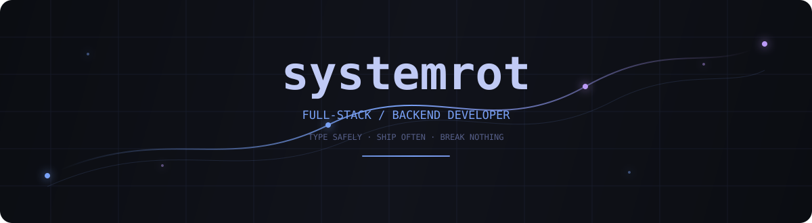

<div align="center">



<br>


<br><br>

<a href="https://github.com/systemrot"></a>
<a href="https://github.com/systemrot?tab=followers"></a>

</div>

---

## About

I'm a **Full-Stack / Backend Developer** focused on building production systems.

I work mostly with **TypeScript, Node.js and React**, backed by relational and NoSQL databases and deployed with containerized infrastructure.

Most of my serious projects are **private and covered by NDA** — so this profile is intentionally more about engineering than a list of repositories.

<table>
<tr>
<td width="55%" valign="top">

**Core**

TypeScript · Node.js · React

**Data**

PostgreSQL · MongoDB · MySQL · Redis

**Infrastructure**

Docker · Kubernetes · Linux · CI/CD

</td>
<td width="45%" valign="top">

```yaml
role: Full-Stack / Backend
focus:
  - APIs & services
  - business logic
  - data
  - infrastructure

projects: private / NDA
```

</td>
</tr>
</table>

---

## Stack

<p align="center">
  
</p>

---

## What I build

<div align="center">

| Backend | Frontend | Data | Infrastructure |
|:---:|:---:|:---:|:---:|
| APIs & services | React apps | PostgreSQL | Docker |
| Auth & business logic | TypeScript UI | MongoDB | Kubernetes |
| WebSockets | Modern web | MySQL | Linux |
| Architecture | Component systems | Redis | CI/CD |

</div>

---

## Currently

```text
┌──────────────────────────────────────────────────────────┐
│  systemrot.dev                                           │
├──────────────────────────────────────────────────────────┤
│                                                          │
│  [████████████████████████████████████████]  ONLINE      │
│                                                          │
│  > writing TypeScript                                    │
│  > building Node.js services                             │
│  > designing APIs                                        │
│  > working with databases                                │
│  > containerizing everything                             │
│  > deploying to Kubernetes                               │
│                                                          │
│  status: ████████████████████ production                 │
│  source: ████████████████████ NDA                        │
│                                                          │
└──────────────────────────────────────────────────────────┘
```

---

## GitHub

<p align="center">
  
</p>

---

## Contributions

<p align="center">
  <picture>
    <source media="(prefers-color-scheme: dark)" srcset="./assets/github-snake-dark.svg">
    <source media="(prefers-color-scheme: light)" srcset="./assets/github-snake.svg">
    
  </picture>
</p>

---

## Private work

<p align="center">

```text
╔════════════════════════════════════════════════════════╗
║                                                        ║
║   ACCESSING PRIVATE PROJECTS...                        ║
║                                                        ║
║   ████████████████████████████████████████████████     ║
║                                                        ║
║   STATUS : ENCRYPTED                                   ║
║   ACCESS : NDA                                         ║
║   MODE   : BUILDING                                    ║
║                                                        ║
╚════════════════════════════════════════════════════════╝
```

**Some of the best things I've built can't be shown here.**

</p>

---

<div align="center">

`build` → `break` → `debug` → `ship` → `repeat`

</div>
